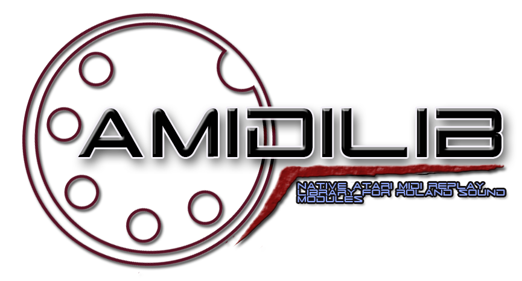

Introduction
------------

AMIDILIB is a C language library which allows easy replay of MIDI files in various formats via external midi port found in all 16/32 bit [Atari home computers](https://en.wikipedia.org/wiki/Atari_ST). 
It supports General Midi instruments (GM1 / GM2) and Roland MT-32 family of synths. Main motivation behind this library was providing midi music replay in games, game ports or other applications with easy to use API, fast integration and minimal processor overhead. It can be build for various m68k processors in various configurations.
 
Library can also preprocess various midi data and export them to custom binary format (nkt), which is more suitable for use in programs and games - 
data doesn't have to be preprocessed before replay, which significantly decreases loading times, it produces smaller files, can be compressed and it is easier to integrate with existing projects via separate, minimal 'nktlib'. 

With use of simple callbacks user can intercept and handle midi events coming from internal / builtin Midi In port.

If you like this project or others feel free to donate to help cover partially my development time and expenses related to hardware. Thank you!
 

Supported MIDI hardware
-----------------------
Software is tested on real Roland MT-32, CM-500 and CM-32L sound modules connected to Atari to Midi Out port and Alesis Q25 Midi controller.

Supported formats matrix
------------------------
Table below describes current support for MIDI file formats in AMIDILIB. It will be updated accordingly as development progresses. 

| format name | format extension | load / parse | replay
| --- | --- | --- | --- |
| `MIDI 0` | MID / SMF | yes | W.I.P |
| `MIDI 1` | MID / SMF | yes | W.I.P |
| `MIDI 2` | MID / SMF | yes | W.I.P |
| `XMIDI` | XMI | W.I.P | W.I.P |
| `RIFF MIDI` (RMID) | RMI | N/A | N/A |
| `Dmx MUS` | MUS | yes | yes * |
| `Custom NKT` | NKT | no | yes |

* after conversion to NKT custom file format

Sample programs brief description
---------------------------------
Below is descriptions of program from demo folders, which are build with an library and they were created during development to test various features of AMIDILIB or as a testbed.

| program name | description |
| --- | --- | 
| `mid2nkt.ttp` | Tool converting Dmx MUS files (used in Doom / Heretic / Hexen games) to custom NKT file format. |
| `midiout.ttp` | Program for testing external midi modules. Play notes, configure midi settings via computer keyboard. Midi events are intercepted from builtin Midi In port and redirected to Midi Out port. It also demonstrates hooking up user defined callback functions for different midi events coming from Midi In port. |
| `midiplay.ttp` | Simple, console based MIDI player. It converts files from table above to internal file format before they can be replayed. |
| `timings.ttp` | Simple, console based program used for internal development to test midi output timings. Output can be set to MIDI or ym2149 soundchip. |
| `nktrep.ttp` | Player for NKT / MUS file format files. MUS files are converted to NKT first. |
| `ymout.tos` | Simple, console based program used for internal development to test ym2149 sound chip output with keyboard. |
| `oplout.ttp` | Simple, console based program used for internal development to test OPL2/3 sound chip output. Plays notes with computer keyboard and / or with incoming messages from Midi In. Program as an input requires instrument definition in DMX format, which contains settings for an OPL2 / 3 chip mapped to GM instrument id's. (Under development) |

Compilation from sources
------------------------

To compile library from sources following tools are needed:

* [SCons build tool](http://scons.org/)
* GCC C cross compiler supporting C99 or better - [Thorsten Otto's FreeMint cross tools page](https://tho-otto.de/crossmint.php) or [gcc(brownelf)](https://bitbucket.org/ggnkua/bigbrownbuild-git/src/master)  
* [VASM m68k cross compiler](http://sun.hasenbraten.de/vasm/)
* Environment like [Cygwin](https://www.cygwin.com/) under Windows or Linux.

Detailed information about building library are in [compilation instructions](compilation.md), basic integration steps with your own programs are in [integration](integration.md).

Currently there's no binaries and official relase as everything is still under heavy development. It might change in the future, when all planned features will be completed and tested. For now everything is provided as is without any warranty, although I try to resolve issues as fast as I can. Documentation and examples are also missing, but they will be provided at official, first version release. You can look into sources in 'demo' directory for now or contact me: [nokturnal@nokturnal.pl](mailto:nokturnal@nokturnal.pl).

Projects using AMIDILIB
-----------------------
[BadMood](http://www.leonik.net/dml/sec_bm.py) BadMooD is an enhanced version of (Linux) Ultimate Doom for Atari Falcon030. It was written specifically for a Atari Falcon030 @ 16MHz + DSP56k @ 32MHz. It uses NKT player and MUS converter.

License
-------------------------
See [LICENSE](LICENSE.md)
