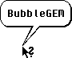
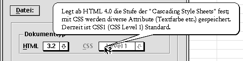
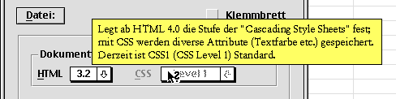
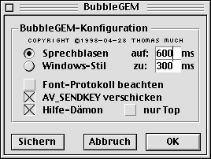

# BubbleGEM 

At the end of the 1990s I wrote ["BubbleGEM"](https://snailshell.de/BubbleGEM/), a small utility for dynamic,
contextual help messages aka ["tooltips"](https://en.wikipedia.org/wiki/Tooltip). BubbleGEM could easily be
integrated into GEM applications on TOS-compatible operating systems.

The messages will either be displayed as speech bubbles (Classic Mac OS style) or as yellow boxes (MS Office style).
This style and other settings (like delay and duration) can be configured system-wide with a control panel extension (CPX).

## Disclaimer

This source code is completely out of date. It is provided as-is without any warranty.

I publish the source files for historical / archaeological reasons only, for informational purposes.
The code is not intended to be used any more, especially not as a template for new code.

## Please note

BubbleGEM was built using the Pure Pascal compiler. The accompanying control panel extension (CPX)
was built using the Pure C compiler.

Have fun! :-)

Thomas\
@thmuch

## Screenshots

